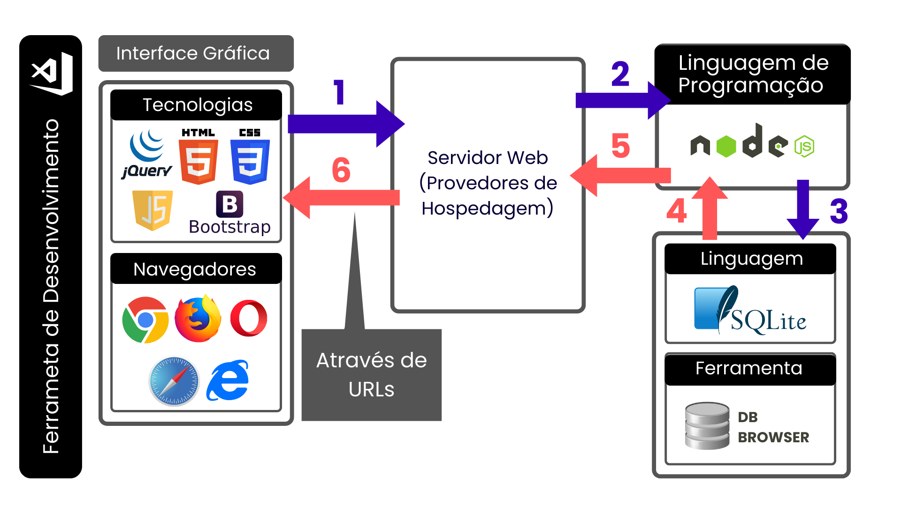

# Projeto3

## Grupo: 

FalCons

## Objetivo: 

Desenvolver uma aplicação para gerar um diagnóstico robusto de maturidade gerencial das redes de ensino considerando 3 pontos:
- Agenda Educacional sob 7 eixos
- Agenda de Gestão
- Indicadores Educacionais

Ferramenta completa de diagnóstico inicial para avaliação da maturidade gerencial das redes de ensino, facilitando assim as análises e tomadas de decisões das redes de ensino quanto às políticas e investimentos em recursos.
Desse modo, iremos desenvolver uma plataforma Web, responsável por garantir a entrega em relação ao preenchimento e armazenamento das informações captadas em relação às respostas para as agendas educacional e de gestão. Assim como os diagnósticos de orientação de acordo com os resultados de cada agenda. Desenvolvida por meio de: 
1. Front-end: 
    - HTML 
    - CSS 
    - Bootstrap
    - JavaScript

2. Back-end: 
    - Node.js com Express.js 

3. Infraestrutura (Banco de Dados): 
    - SQL

## Arquitetura do Sistema: 
